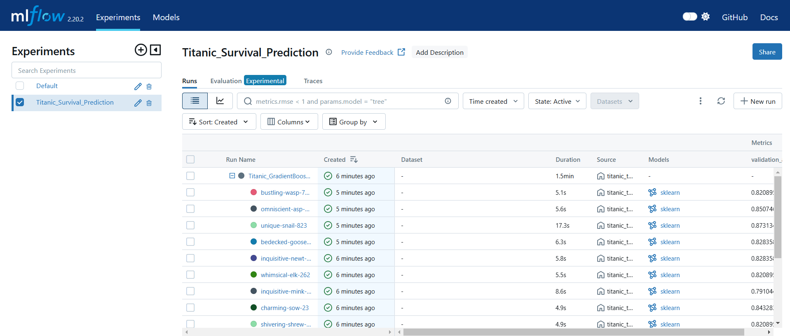
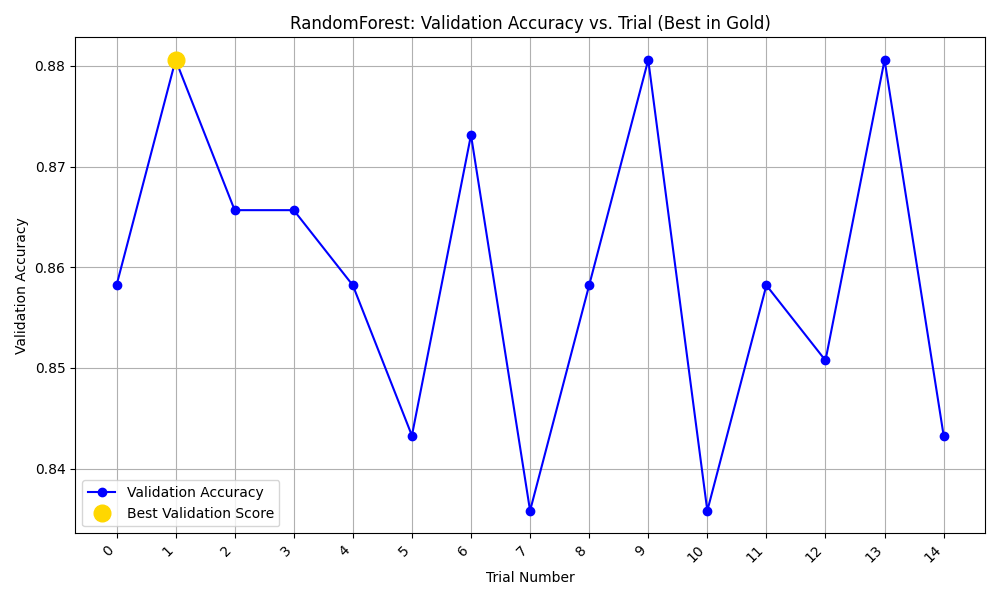
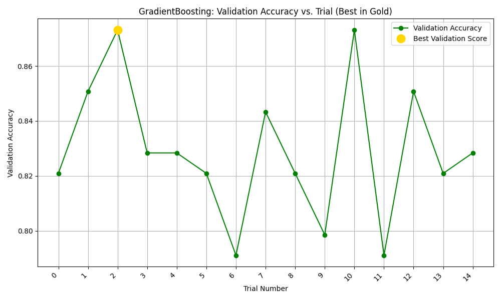
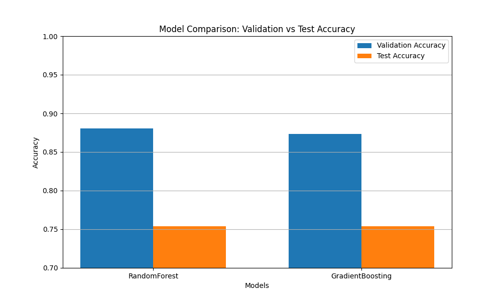

# **🚢 Titanic Survival Prediction with MLflow and Optuna**

This repository demonstrates how to implement **hyperparameter tuning** with **MLflow** and **Optuna** using the Titanic dataset from Kaggle. The project includes **feature engineering, model training, and hyperparameter optimization** for two classification models: **Random Forest** and **Gradient Boosting**.

---

## **📌 Project Overview**

The Titanic dataset is a classic machine learning problem where the goal is to **predict which passengers survived the Titanic shipwreck**. This implementation showcases:

- **Parent and child runs in MLflow** for structured experiment tracking.
- **Hyperparameter tuning with Optuna** for improved model performance.
- **Feature engineering and preprocessing** for categorical and numerical data.
- **Comparison of two classification algorithms**: Random Forest and Gradient Boosting.
- **Visualization of tuning results** and model performance in MLflow.

---

## **🔍 What is Optuna?**

[Optuna](https://optuna.org/) is an **automated hyperparameter optimization framework** designed to efficiently search for the best hyperparameters in machine learning models. It features:

- **Tree-structured Parzen Estimator (TPE)** for intelligent hyperparameter searching.
- **Pruning of unpromising trials** to speed up optimization.
- **Parallel optimization** for faster tuning.
- **Easy integration with MLflow** for tracking and logging results.

With Optuna, we can optimize **hyperparameters like learning rate, depth of trees, and number of estimators** in models such as **Random Forest and Gradient Boosting**.

---

## **⚙️ Prerequisites**

Ensure you have the following dependencies installed:

- Python **3.8+**
- **MLflow** (for experiment tracking)
- **Optuna** (for hyperparameter tuning)
- **scikit-learn** (for model training)
- **pandas** (for data processing)
- **matplotlib** (for visualization)
- **Kaggle API** (optional, for dataset download)

---

## **📊 Dataset**

The Titanic dataset includes:

- **Passenger details** (age, sex, class, etc.)
- **Family information** (siblings/spouses, parents/children)
- **Ticket & cabin details**
- **Fare price**
- **Survival status** (target variable: `Survived`)

---

## **📥 Installation**

```bash
# Clone the repository
git clone https://github.com/Khadiza13/MLflow-hyperparameter-tuning
cd MLflow-hyperparameter-tuning

# Create and activate a virtual environment
python -m venv venv
source venv/bin/activate

# Install dependencies
pip install -r requirements.txt
```

---

## **📂 Getting the Dataset**

### **Option 1: Download manually from Kaggle**

1. Go to [Kaggle Titanic Dataset](https://www.kaggle.com/c/titanic/data)
2. Download `train.csv` and place it in the project root directory.

### **Option 2: Use Kaggle API**

```bash
# Configure Kaggle API credentials first
kaggle competitions download -c titanic
unzip titanic.zip
```

---

## **🚀 Running the Project**

### **Step 1: Run Hyperparameter Tuning**

```bash
python titanic_tuning.py
```

### **Step 2: Launch MLflow UI**

```bash
mlflow ui
```

After running `mlflow ui`, open **[http://localhost:5000](http://localhost:5000)** in your browser to visualize the tuning results.

---

## **Results**

### Parent-Child runs:



### Validation Accuracy:

Random Forest:


Gradient Boosting:


### Model Comparison:



## **📌 Conclusion**

This project demonstrates how to **optimize machine learning models** using **Optuna and MLflow**. By leveraging **automated hyperparameter tuning**, we enhance model performance while efficiently tracking experiments. 🚀
